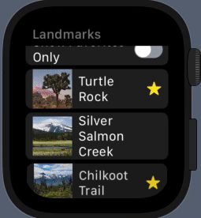
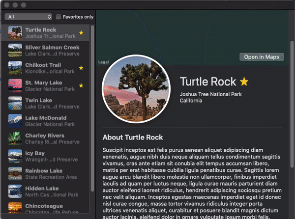

<p align="center">
  <a href="https://github.com/Rigo-Hernandez/Landmarks-">
    
  </a>

  <h3 align="center">Landmarks</h3>

  <p align="center">
    A native on all Apple Platforms Application for discovering and sharing the places you love built with SwiftUI. This project was created following the Apple documentation tutorial to help me get an understanding on integrating new features SwiftUI offers such as Declerative Syntax and Reusable Components.
    <br>
  </p>
</p>


## Table of contents

- [Quick start](#quick-start)
- [What's included](#whats-included)
- [Thanks](#thanks)
- [Copyright and license](#copyright-and-license)


## Quick start

- Open Project With XCode 11 
- Landmarks folder contains data models and UI Essentials 

    
- WatchLandmarks folder contains WatchOS Application 


- MacLandmarks folder contains MacOS Application 




## What's included


```Data models and Landmark View Structure
Landmarks/
└── Landmarks/
    ├── Models/
    │   ├── Data.swift
    │   ├──Hike.swift
        ├──Landmark.swift
        ├──Profile.swift
        └── UserData.swift
    └── Landmark Views/
        ├── LandmarkDetail.swift
        ├── LandmarkList.swift
        └── LandmarkRow.swift
```

## Thanks

Big thanks to the team at Apple for the extremely resourceful and fun project to understand the core concepts of using SwiftUI to build interfaces across all apple platforms.

## Copyright and license

Code and documentation copyright 2019-2020 the authors. Code released under the [MIT License](https://reponame/blob/master/LICENSE).

Enjoy :metal:
